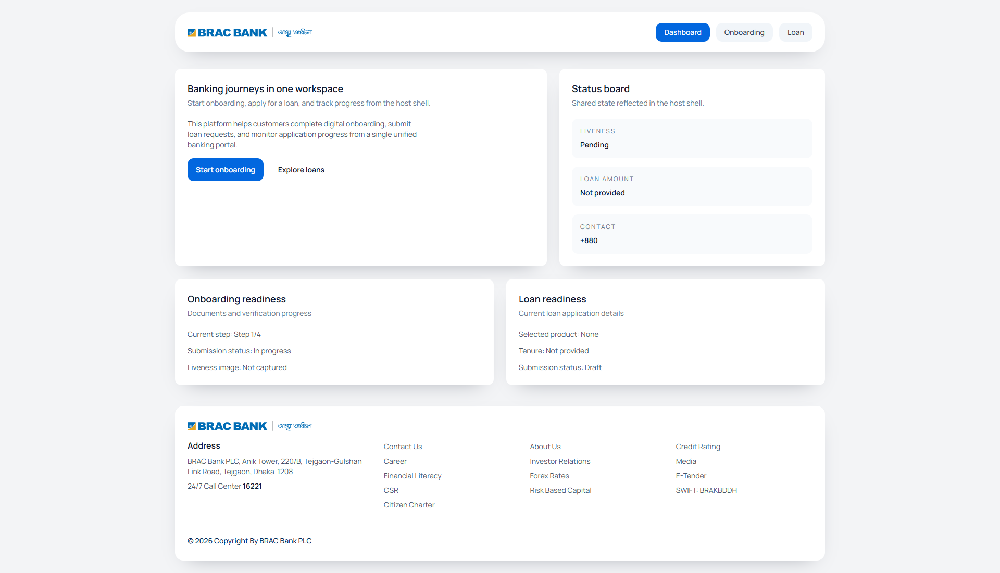
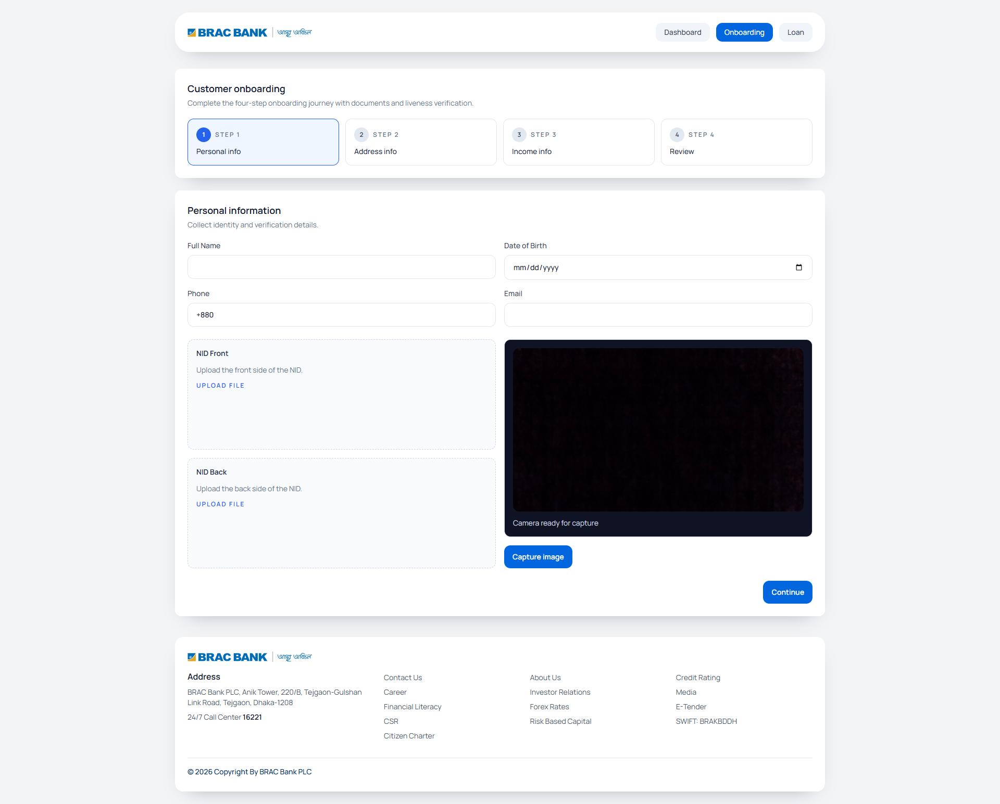
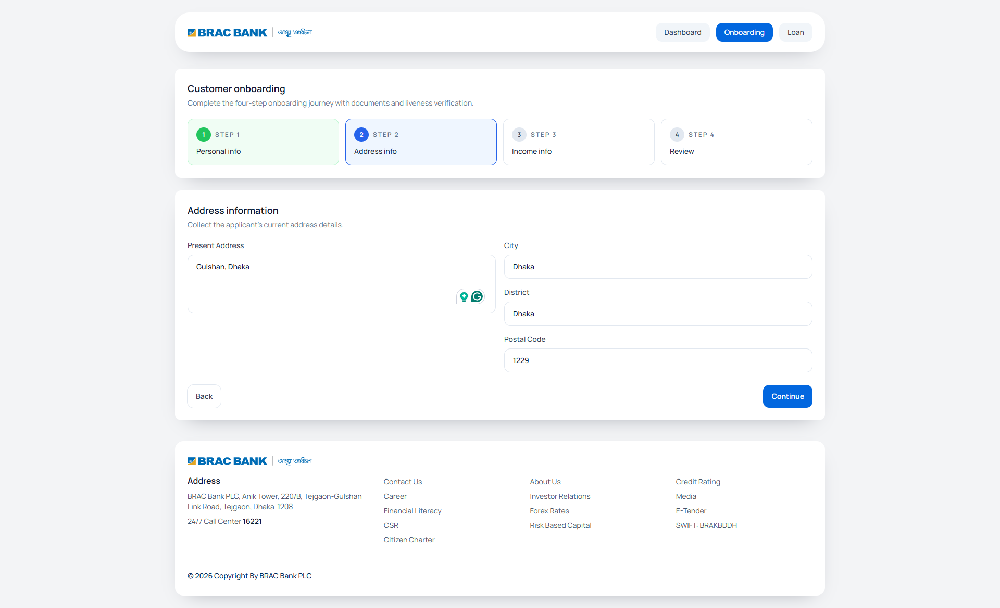
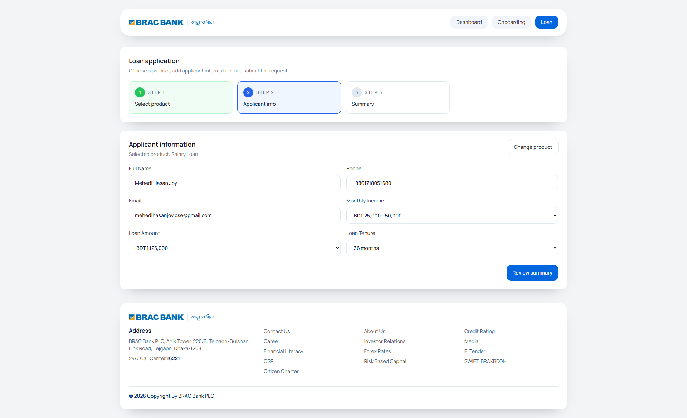
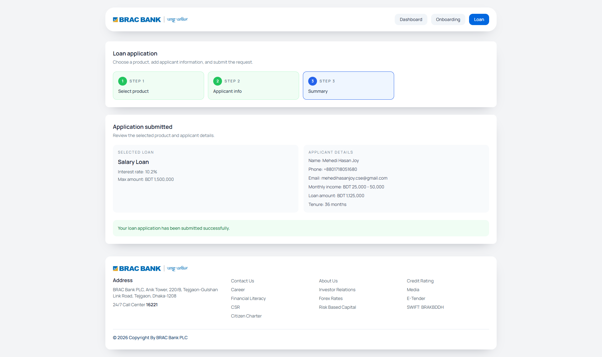

# React Banking Micro-Frontend


A `pnpm` monorepo implementing a banking micro-frontend assignment with:

- `app-shell` host on `http://localhost:3000`
- `loan-mfe` remote on `http://localhost:3001`
- `onboarding-mfe` remote on `http://localhost:3002`
- shared UI components in `packages/ui-library`
- shared Zustand store in `packages/store`

## Architecture

- `Vite Module Federation` exposes `loan-mfe/App` and `onboarding-mfe/App`
- `app-shell` lazy-loads both remotes with `React.lazy` and `Suspense`
- shared applicant, onboarding, and loan state is stored in a single Zustand store
- all UI uses the shared Tailwind-based component library

## Features

- dashboard route in the host shell with shared-state summary
- 4-step onboarding wizard:
  - personal information
  - address information
  - income information
  - review and submit
- dummy face liveness flow using the browser camera API and simulated verification
- NID front and back upload status via shared uploader components
- 3-step loan application flow:
  - product selection from local JSON
  - applicant information
  - summary and submit

## Workspace Layout

```text
apps/
  app-shell/
  loan-mfe/
  onboarding-mfe/
packages/
  store/
  ui-library/
```

## Setup

```bash
pnpm install
pnpm dev
```

`pnpm dev` starts the host with Vite dev and serves both remotes from built `dist` output in watch mode. This is necessary because the federation plugin does not expose `remoteEntry.js` from Vite remote dev servers.

## Build

```bash
pnpm build
```

## Notes

- Loan products are loaded from a local JSON file to mimic an API response.
- Shared state is kept in memory for local development.
- Camera access depends on the browser and device permissions.

## Preview






